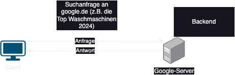

# 24-11-Wiki

## Frontend vs. Backend

- `Frontend`: bezeichnet den Teil einer Webseite oder Anwendung, der für den Benutzer sichtbar und
direkt interagierbar ist. Es umfasst alle visuellen Elemente wie Layout, Design, Navigation und
Interaktivität, die mit Technologien wie HTML, CSS und JavaScript umgesetzt werden.

- `Backend` : bezeichnet den Teil einer Webseite oder Anwendung, der für den Benutzer unsichtbar ist
und hinter den Kulissen arbeitet. Es umfasst Server, Datenbanken und die Logik, die für die
Verarbeitung von Anfragen, das Speichern von Daten und die Kommunikation mit dem Frontend
verantwortlich ist. Backend-Technologien sind z.B. Programmiersprachen wie Python, Java, Node.js
und Datenbanken wie MySQL oder MongoDB.

# Client vs. Server

- `Client`: ist ein Gerät oder eine Software, die auf Anfragen an einen Server zugreift, um Dienste
oder Informationen zu erhalten. In der Webentwicklung ist der Client häufig der Webbrowser eines
Nutzers, der eine Webseite anfordert und anzeigt. Der Client kommuniziert mit dem Server, um
Daten zu empfangen oder zu senden.

- `Server` : ist ein Computer oder ein System, das Ressourcen, Daten oder Dienste für andere
Computer (Clients) bereitstellt. In der Webentwicklung ist ein Server dafür verantwortlich, Anfragen
von Clients zu empfangen, zu verarbeiten und die entsprechenden Daten oder Webseiten
zurückzusenden.

# Internet

- `Internet`: ist ein globales Netzwerk von miteinander verbundenen Computern und Servern, das
den Austausch von Informationen und die Kommunikation über verschiedene Dienste wie
Webseiten, E-Mails und soziale Medien ermöglicht. Es verbindet Milliarden von Nutzern weltweit und
ist eine zentrale Plattform für Daten, Kommunikation und digitale Dienstleistungen.

# Pfade

- `absoluter Pfad`: ist ein vollständiger Verweis auf eine Datei oder ein Verzeichnis im Dateisystem,
der den gesamten Weg vom Root-Verzeichnis (dem obersten Verzeichnis) bis zur Ziel-Datei oder-
Ordner beschreibt. Er beginnt in der Regel mit einem Festplattenverzeichnis (z. B. / auf Unix-
Systemen oder C:\ auf Windows) und gibt den gesamten Pfad an.

- `relativer Pfad`: ist ein Verweis auf eine Datei oder ein Verzeichnis, der sich im Verhältnis zum
aktuellen Arbeitsverzeichnis (also dem Verzeichnis, in dem man sich gerade befindet) orientiert. Er
gibt nur den Teil des Pfads an, der notwendig ist, um von diesem Punkt aus das Ziel zu erreichen,
ohne den gesamten Verzeichnisbaum anzugeben.

# Entwicklungsumgebung

- `IDE`: (Integrated Development Environment) ist eine Software, die Entwicklern eine Sammlung
von Werkzeugen zur Verfügung stellt, um Programme zu schreiben, zu testen und zu debuggen. Eine
IDE enthält typischerweise einen Code-Editor, Compiler oder Interpreter, Debugger und oft auch
eine Benutzeroberfläche zur einfachen Verwaltung von Projekten. Beispiele für IDEs sind Visual
Studio, IntelliJ IDEA und Eclipse.

# Software vs. Hardware vs. Betriebssystem

- `Software`: ist eine Sammlung von Programmen, Daten und Anweisungen, die einem Computer oder
einem anderen digitalen Gerät sagen, wie es Aufgaben ausführen soll. Sie kann aus
Betriebssystemen, Anwendungen, Tools oder Spielen bestehen und ermöglicht es,
Hardwarefunktionen zu steuern und verschiedene Aufgaben zu erledigen.

- `Hardware`: bezeichnet die physischen Komponenten eines Computers oder eines digitalen Geräts, wie
zum Beispiel den Prozessor, den Arbeitsspeicher, die Festplatte, die Tastatur und das Display. Sie ist
die materielle Grundlage, auf der Software ausgeführt wird.

- `Betriebssystem`: (OS) ist eine Software, die die grundlegenden Funktionen eines Computers oder
digitalen Geräts verwaltet, wie z.B. die Steuerung der Hardware, die Verwaltung von Dateien und die
Bereitstellung einer Benutzeroberfläche. Es ermöglicht die Ausführung von Anwendungen und sorgt
dafür, dass verschiedene Programme und Ressourcen effizient zusammenarbeiten. Beispiele sind
Windows, macOS und Linux.

## Hardwarekomponente

- `CPU`: (Central Processing Unit), auch Prozessor genannt, ist das Herzstück eines Computers. Sie
führt die Befehle von Programmen aus, verarbeitet Daten und steuert die Operationen der anderen
Hardwarekomponenten. Sie ist verantwortlich für die Berechnungen und die Logikoperationen, die
für das Funktionieren des Systems erforderlich sind.

- `GPU`: (Graphics Processing Unit), auch Grafikkarte genannt, ist eine spezialisierte Recheneinheit,
die für die Berechnung und Darstellung von Grafiken und visuellen Inhalten auf einem Bildschirm
verantwortlich ist. Sie wird vor allem in der 3D-Grafik, Videoverarbeitung und zunehmend auch in
der Datenverarbeitung (z.B. Künstliche Intelligenz) eingesetzt.

- `RAM`: (Random Access Memory) ist der Arbeitsspeicher eines Computers, in dem temporär Daten
und Programme gespeichert werden, die aktuell genutzt oder verarbeitet werden. RAM ist schnell
und ermöglicht einen schnellen Zugriff auf diese Daten, wird jedoch beim Ausschalten des
Computers gelöscht.